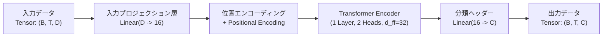

# 軽量トランスフォーマー (Lightweight Transformer) アーキテクチャ詳細仕様書

本ドキュメントは、BioVid Heat Pain Database（Part B）を用いた疼痛強度推定のために設計した **「軽量トランスフォーマー (Lightweight Transformer)」** の設計思想、入力データ・出力データの具体的な仕様、内部ネットワーク構造、および学習手法についてまとめた仕様書です。

---

## 1. 設計思想 (Design Philosophy)

本研究において、一般的な重いディープラーニングモデル（CNNや大規模Transformer）ではなく、独自にカスタマイズした「軽量トランスフォーマー」を設計した理由は以下の3点にあります。

### ① 生生理波形依存からの脱却とパラメータ削減（過学習の完全回避）
*   **課題**: 生波形（数百〜数千Hzの時系列データ）に対して深層CNNやトランスフォーマーをそのまま適用すると、モデルのパラメータ数が肥大化します。その結果、訓練データの被験者の「波形形状やノイズパターン」を丸暗記してしまい、未知の被験者を評価する被験者独立（LOSO）交差検証で精度が破綻します（Thiam et al. 2021 の再現検証でも精度13.33%に崩壊することを実証済み）。
*   **アプローチ**: 生波形ではなく、生理学的に意味のある特徴量（EDAのTonic/Phasic成分、ECGのHRV指標など）を抽出し、**埋め込み次元 $d_{model}=16$、エンコーダ層数 $1$** という超軽量モデルにすることで、パラメータ数を過学習が起きない限界まで小さく抑えました。

### ② Self-Attentionによる動的キャリブレーション（被験者内相対評価）
*   **課題**: 生理信号は個人差（ベースラインのズレや発汗応答の強弱）が極めて大きく、単一の試行のみを見て痛みの絶対レベルを判定することは困難です。
*   **アプローチ**: Transformerの Self-Attention（自己注意機構）を活用することで、1被験者の全試行シーケンスの中で「他の試行と比較してどの程度心拍や発汗が跳ね上がっているか」という**動的な被験者内キャリブレーション（相対評価）**をモデル内部で自律的に行わせます。

### ③ 実験プロトコル暗記リークの完全排除
*   **課題**: BioVidデータセットは全被験者で熱刺激の提示順序（L0〜L4の時系列スケジュール）が全く同一です。このため、標準の時系列順のままシーケンスモデルに入力すると、AIは生理特徴量を無視して「$t$番目の試行はL4である」というプロトコル手順のインデックスを丸暗記してしまいます。
*   **アプローチ**: 試行の局所的な時間文脈（前後差分など）は特徴量側に保持させたうえで、**被験者ごとに試行シーケンスの順序をランダムシャッフルして入力**する設計を採用しました。これにより、AIが手順を暗記することを防止し、純粋に「生理的特徴」から時系列文脈を分類するモデルとしました。

---

## 2. 入出力仕様 (Inputs & Outputs)



### 入力層 (Input Layer) の仕様
*   **入力テンソルの形状 (Tensor Shape)**: `(Batch Size, Sequence Length, Input Dimension)` = `(B, T, D)`

| 軸 | 記号 | 次元数 / 意味 | 詳細説明 |
|---|---|---|---|
| **第1軸** | `B` (Batch Size) | `16` (訓練時) / `1` (テスト時) | LOSO評価時、テストフェーズでは1被験者（1単位）ずつ入力。 |
| **第2軸** | `T` (Sequence Length) | `100` (5クラス時) / `40` (2クラス時) | 1被験者が受けた全刺激試行のシーケンス長。<br>・5クラス分類: L0, L1, L2, L3, L4 各20回 ➔ 計100試行<br>・2クラス分類: L0(20回) + L4(20回) ➔ 計40試行 |
| **第3軸** | `D` (Input Dimension) | `12` / `13` / `36` / `39` | 各試行における入力生理特徴量の次元数（実験設定C1〜C4による）。 |

#### 【入力特徴量 $D$ の実験構成内訳】
入力される特徴量行列は、事前に被験者内標準化（Z-score Normalization）が適用されています。

1.  **C1 (12次元)**: 基本生理特徴量（EDA: Tonic/Phasic振幅, AUC, ピーク数 + ECG: Mean RRI, SDNN, RMSSD, pNN50等 12指標）
2.  **C2 (13次元)**: C1 (12次元) ＋ 安静時ベースライン相対変化率（$\Delta RRI$）
3.  **C3 (36次元)**: C1 (12次元) ＋ 直前3試行移動平均 (rolling3: 12次元) ＋ 前試行差分 (diff: 12次元)
4.  **C4 (39次元)**: C3 (36次元) ＋ $\Delta RRI$（およびその rolling3 / diff: 3次元）

---

### 出力層 (Output Layer) の仕様
*   **出力テンソルの形状 (Tensor Shape)**: `(Batch Size, Sequence Length, Num Classes)` = `(B, T, C)`

| 軸 | 記号 | 次元数 / 意味 | 詳細説明 |
|---|---|---|---|
| **第1軸** | `B` (Batch Size) | `16` / `1` | 入力バッチ対応。 |
| **第2軸** | `T` (Sequence Length) | `100` / `40` | 各試行の時系列インデックス。 |
| **第3軸** | `C` (Num Classes) | `5` (5クラス分類) / `2` (2クラス分類) | 各試行における疼痛レベルの予測確率（Logits）。 |

#### 【最終判定 (Prediction Output)】
各試行 $t \in [1, T]$ について、最終的な予測疼痛レベル $\hat{y}_t$ は出力テンソルのクラス軸に対する `argmax` によって取得されます。
$$\hat{y}_t = \arg\max_{c \in \{0, \dots, C-1\}} \text{Logits}(t, c)$$
*   **5クラス分類時**: $\hat{y}_t \in \{0: L0, 1: L1, 2: L2, 3: L3, 4: L4\}$
*   **2クラス分類時**: $\hat{y}_t \in \{0: L0(\text{無痛}), 1: L4(\text{最大痛})\}$

---

## 3. 内部ネットワーク構造詳細

PyTorchコードに基づく、各レイヤーのパラメータ設定と処理内容は以下の通りです。

```python
class LightweightTransformer(nn.Module):
    def __init__(self, input_dim, embed_dim=16, num_heads=2, num_layers=1, num_classes=5, seq_len=100):
        super().__init__()
        # 1. 入力投影層
        self.input_proj = nn.Linear(input_dim, embed_dim)
        # 2. 位置エンコーディング
        self.pos_encoder = nn.Parameter(torch.zeros(1, seq_len, embed_dim))
        
        # 3. 軽量Transformerエンコーダ層
        encoder_layer = nn.TransformerEncoderLayer(
            d_model=embed_dim,       # 16
            nhead=num_heads,         # 2
            dim_feedforward=embed_dim * 2, # 32
            dropout=0.1, 
            batch_first=True
        )
        self.transformer = nn.TransformerEncoder(encoder_layer, num_layers=num_layers) # 1 Layer
        
        # 4. 試行別分類ヘッダー
        self.classifier = nn.Linear(embed_dim, num_classes)
```

### レイヤー別詳細仕様

1.  **Linear Input Projection (入力プロジェクション)**:
    *   `nn.Linear(input_dim, 16)`
    *   各試行の入力特徴量ベクトル（$D$次元）を、トランスフォーマー内部で処理される統一表現空間（16次元）へ一次変換します。
2.  **Positional Encoding (位置エンコーディング)**:
    *   `nn.Parameter(torch.zeros(1, T, 16))`
    *   シーケンス内の相対的な順序関係をアテンション計算に付加するための学習可能パラメータです。
3.  **Transformer Encoder Layer (トランスフォーマーエンコーダ)**:
    *   **Multi-Head Self-Attention**: `nhead = 2`（ヘッドあたり8次元）。試行間の相互参照関係（どの試行とどの試行の生理反応が類似・解離しているか）を計算。
    *   **Feed-Forward Network (FFN)**: 16 ➔ 32 ➔ 16次元の2層全結合ネットワーク（活性化関数: GELU/ReLU, Dropout: 0.1）。
    *   **Layer Normalization & Residual Connection**: 各サブレイヤー前後に残差接続と標準化を配置し、安定した勾配伝搬を実現。
4.  **Classification Head (分類器)**:
    *   `nn.Linear(16, C)`
    *   エンコーダが出力した16次元の時系列特徴ベクトルを、最終的なクラス数 $C$ のロジット値へ変換します。

---

## 4. 損失関数と最適化手法

*   **損失関数 (Loss Function)**: 多クラス交差エントロピー損失 (Cross-Entropy Loss)
    $$\mathcal{L} = -\frac{1}{B \cdot T} \sum_{b=1}^{B} \sum_{t=1}^{T} \log \left( \frac{\exp(z_{b, t, y_{b, t}})}{\sum_{c=0}^{C-1} \exp(z_{b, t, c})} \right)$$
    （※各試行における正解疼痛ラベル $y_{b,t}$ と予測ロジット $z_{b,t,c}$ の誤差を計算）
*   **最適化アルゴリズム (Optimizer)**: Adam Optimizer (`lr = 0.005`, `weight_decay = 1e-4`)
*   **エポック数 / バッチサイズ**: `Epochs = 40`, `Batch Size = 16`
